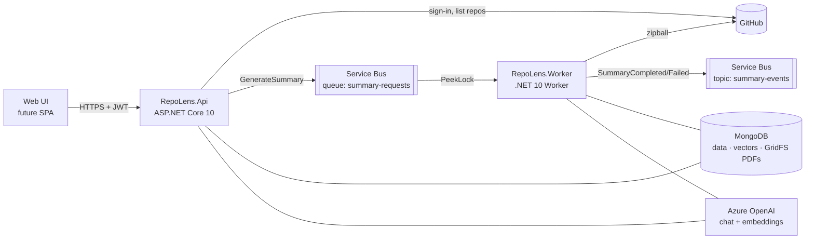

# RepoLens

A .NET 10 backend that signs users in with GitHub and lists all of their repositories. It turns any repository into an **onboarding PDF** through an event-driven background job, and it **answers questions about the code** with citations to exact lines.

- **Sign in with GitHub** (OAuth + PKCE). The API issues its own JWT access tokens with rotating refresh tokens.
- **Repository table**: every repository the user can access (owned, collaborator, organization), with summary status and a link to the latest PDF.
- **Summarize**: returns `202 Accepted` right away. A worker downloads the repository, indexes the code, writes a structured summary with an AI model and renders a PDF.
- **Ask a question**: retrieval-augmented answers grounded in the repository's code, as JSON or streamed with Server-Sent Events. Every answer cites `file:lines` with a GitHub link.
- **MongoDB for everything**: data, search vectors, PDFs (GridFS) and encryption keys.
- **Azure-ready**: Service Bus, Cosmos DB for MongoDB (vCore), Azure OpenAI, Key Vault, Container Apps and Application Insights. A Bicep template deploys all of it.

See [`docs/sample-summary.pdf`](docs/sample-summary.pdf) for what a generated PDF looks like, and [`docs/ARCHITECTURE.md`](docs/ARCHITECTURE.md) for the design.

---

## Contents

1. [Architecture at a glance](#architecture-at-a-glance)
2. [Project layout](#project-layout)
3. [Run it locally](#run-it-locally)
4. [Try the API in Swagger](#try-the-api-in-swagger)
5. [API reference](#api-reference)
6. [How Summarize works](#how-summarize-works)
7. [Configuration](#configuration)
8. [Tests](#tests)
9. [Deploy to Azure](#deploy-to-azure)
10. [Extending RepoLens](#extending-repolens)
11. [Troubleshooting](#troubleshooting)

---

## Architecture at a glance



The **API** only does fast work: sign-in, the repository table, queuing a summary, status, PDF download and questions. The **Worker** does the slow part: turning a repository into a PDF. The only thing connecting them is a message on Service Bus. For local development without Azure, an in-memory bus replaces Service Bus, and the API processes summaries itself.

## Project layout

```
RepoLens/
├─ src/
│  ├─ RepoLens.Domain/          entities and rules (no dependencies): SummaryJob state machine, Conversation, …
│  ├─ RepoLens.Application/     use cases + ports (interfaces), prompts, summary pipeline, job processor
│  ├─ RepoLens.Infrastructure/  MongoDB, GitHub, Service Bus / in-memory bus, OpenAI, QuestPDF, security
│  ├─ RepoLens.Api/             controllers, GitHub OAuth + JWT, Problem Details, rate limiting, Swagger
│  └─ RepoLens.Worker/          Service Bus consumer that runs the summary pipeline
├─ tools/RepoLens.DevMongo/     local MongoDB 8 for development, no Docker or installer needed
├─ tests/
│  ├─ RepoLens.UnitTests/       domain, pipeline, retry logic, tokens, PDF, chunking, …
│  └─ RepoLens.IntegrationTests/ the real API against a real MongoDB (GitHub and AI faked)
├─ deploy/                      Bicep template for Azure
└─ docs/                        architecture notes and a sample PDF
```

Dependencies point inward: `Api`, `Worker` → `Infrastructure` → `Application` → `Domain`.

## Run it locally

### 1. Prerequisites

| What | How |
|---|---|
| .NET 10 SDK | `winget install Microsoft.DotNet.SDK.10`, or from <https://dot.net>. `global.json` requires 10.0. |
| HTTPS dev certificate | `dotnet dev-certs https --trust` (GitHub sign-in cookies need HTTPS) |
| MongoDB | Nothing to install: step 2 runs one. Any MongoDB 6+ or a free Atlas cluster also works. |
| GitHub OAuth App | Step 3 |
| AI model | Azure OpenAI (endpoint + deployments) or an OpenAI API key |

### 2. Start MongoDB

```powershell
dotnet run --project tools/RepoLens.DevMongo
```

The first run downloads the official MongoDB 8 binaries (about 100 MB). After that it starts in seconds on `mongodb://localhost:27017`, keeping data in `.data/mongo`. Leave it running and stop it with Ctrl+C. If Windows Firewall asks about `mongod`, allowing private networks is enough.

### 3. Create a GitHub OAuth App

GitHub → **Settings → Developer settings → OAuth Apps → New OAuth App**:

| Field | Value |
|---|---|
| Homepage URL | `https://localhost:7180` |
| Authorization callback URL | `https://localhost:7180/api/v1/auth/github/callback` |

Copy the **Client ID** and generate a **Client secret**.

### 4. Set your secrets

Secrets stay in [user secrets](https://learn.microsoft.com/aspnet/core/security/app-secrets), outside the repository:

```powershell
cd src/RepoLens.Api
dotnet user-secrets set "GitHub:ClientId" "<client id>"
dotnet user-secrets set "GitHub:ClientSecret" "<client secret>"

# Azure OpenAI (model names are your deployment names)
dotnet user-secrets set "Ai:Provider" "AzureOpenAI"
dotnet user-secrets set "Ai:Endpoint" "https://<your-resource>.openai.azure.com"
dotnet user-secrets set "Ai:ApiKey" "<key>"
dotnet user-secrets set "Ai:ChatModel" "gpt-5-mini"
dotnet user-secrets set "Ai:EmbeddingModel" "text-embedding-3-small"

# …or OpenAI instead
dotnet user-secrets set "Ai:Provider" "OpenAI"
dotnet user-secrets set "Ai:ApiKey" "sk-..."
```

`appsettings.Development.json` already points at the local MongoDB, uses the in-memory message bus and in-app vector search, and includes a development-only JWT signing key.

### 5. Run the API

```powershell
dotnet run --project src/RepoLens.Api --launch-profile https
```

Swagger UI opens at **<https://localhost:7180/swagger>**. In VS Code, press **F5** and pick **API (Swagger)**.

## Try the API in Swagger

1. In the browser, open **<https://localhost:7180/api/v1/auth/github/login>** and approve the app on GitHub.
2. You land on a development page showing an **access token**. Copy it.
3. In Swagger UI, click **Authorize**, paste the token and confirm.
4. `GET /api/v1/repos` returns your repositories (synced from GitHub on first use).
5. `POST /api/v1/repos/{repoId}/summaries` returns **202 Accepted** with a `Location` header.
6. Poll `GET /api/v1/summaries/{jobId}` until `status` is `Completed`. `stage` and `progress` show where it is.
7. `GET /api/v1/summaries/{jobId}/pdf` returns the PDF (add `?download=true` to save it as a file).
8. `POST /api/v1/repos/{repoId}/questions` with `{ "question": "Where are orders created?" }` returns an answer with citations.

In a real frontend, set `Frontend:AuthCallbackUrl` to your page (for example `http://localhost:3000/auth/callback`). The page receives `?code=…` and exchanges it with `POST /api/v1/auth/token`. The code is valid for 60 seconds and works once. Tokens never appear in URLs.

## API reference

All endpoints are under `/api/v1` and require `Authorization: Bearer <token>` unless marked *public*. Errors are [RFC 9457 Problem Details](https://www.rfc-editor.org/rfc/rfc9457) with a stable `code` (for example `repo_not_indexed`, `github_reauth_required`) and a `traceId`.

| Method | Path | What it does |
|---|---|---|
| GET | `/auth/github/login` *(public)* | Starts GitHub sign-in (browser navigation) |
| POST | `/auth/token` *(public)* | Exchanges the one-time code for an access token + refresh token |
| POST | `/auth/refresh` *(public)* | Rotates the refresh token and returns a new pair |
| POST | `/auth/logout` *(public)* | Revokes the refresh token |
| GET | `/me` | Current user |
| GET | `/repos?page&pageSize&search&sort` | The repository table: rows with summary status, latest PDF link and index state |
| POST | `/repos/sync` | Refreshes the list from GitHub now |
| GET | `/repos/{repoId}` | One repository |
| POST | `/repos/{repoId}/summaries?force` | **Summarize.** `202` new or in progress, `200` if this commit is already summarized |
| GET | `/repos/{repoId}/summaries` | Summary history |
| GET | `/summaries/{jobId}` | Status: `Queued`/`Processing`/`Completed`/`Failed`, stage, progress, error |
| GET | `/summaries/{jobId}/pdf?download` | The PDF (inline, or as an attachment) |
| POST | `/repos/{repoId}/questions` | Asks a question; pass `conversationId` for follow-ups |
| POST | `/repos/{repoId}/questions/stream` | Same, as Server-Sent Events: `start`, `delta`…, `done` (or `error`) |
| GET | `/repos/{repoId}/conversations` | Past conversations about a repository |
| GET / DELETE | `/conversations/{id}` | Read or delete one conversation |
| GET | `/health/live`, `/health/ready` *(public)* | Liveness; readiness checks MongoDB |

Rate limits per user: 30 summaries per hour, 20 questions per minute, 30 syncs per hour and 300 requests per minute overall (configurable). A rejected request returns `429` with `Retry-After`.

## How Summarize works

```mermaid
sequenceDiagram
    participant UI
    participant API
    participant DB as MongoDB
    participant SB as Service Bus
    participant W as Worker
    UI->>API: POST /repos/{id}/summaries
    API->>DB: insert job (Queued; one active job per repo)
    API->>SB: GenerateSummary (MessageId = jobId)
    API-->>UI: 202 Accepted + Location
    SB->>W: deliver (PeekLock, auto-renewed)
    W->>DB: claim job → Processing
    W->>W: resolve commit → download zipball → chunk + embed → map/reduce summary → PDF
    W->>DB: store PDF (GridFS), job → Completed
    W->>SB: SummaryCompleted event
    UI->>API: GET /summaries/{jobId} (poll) → Completed
    UI->>API: GET /summaries/{jobId}/pdf
```

What makes it reliable:

- **No duplicate jobs.** A unique partial index allows one active job per repository, so double clicks return the same job. Summarizing an unchanged commit returns the existing PDF instantly (`force=true` regenerates).
- **No lost requests (outbox).** The job document records whether its command reached the broker. The API publishes immediately, and a dispatcher re-publishes anything left unpublished. Service Bus duplicate detection uses `MessageId = jobId`.
- **Retries and dead-lettering.** Transient failures (GitHub or AI outages) put the job back in the queue with exponential backoff. Permanent ones (repository gone, token revoked) fail it immediately with a readable reason. After 5 deliveries the message goes to the dead-letter queue and the job shows `Failed`.
- **Crash-safe.** Workers send heartbeats. A job whose worker died is re-queued after 15 minutes, and optimistic concurrency stops two workers from finishing the same job.
- **One GitHub call per job.** The repository is downloaded as a zipball at the exact commit, not file by file.

The summary is generated **map → reduce**. Small repositories go through a single model call. Larger ones get one call per module (in parallel), then a final call combines the module notes with the README, manifests, configuration and file tree into a fixed JSON shape. QuestPDF lays out that shape, so every PDF has the same sections: overview, tech stack, architecture, module map, key flows, entry points, data model, configuration, build/run/test, where to start and a glossary.

**Questions** use the index the Summarize job builds. The question is embedded, the closest code chunks of the indexed commit are retrieved, and the model answers with `[n]` markers. The API turns those markers into `path:start-end` citations with GitHub links. Asking before the first summary returns `409 repo_not_indexed`.

## Configuration

Key settings (`appsettings.json`, environment variables with `__`, user secrets or Key Vault):

| Setting | Default | Purpose |
|---|---|---|
| `Mongo:ConnectionString` / `DatabaseName` | – / `repolens` | MongoDB, Atlas or Cosmos DB for MongoDB (vCore) |
| `GitHub:ClientId` / `ClientSecret` | – | OAuth App. Without them the API still runs, and sign-in returns `503 github_signin_not_configured` |
| `Auth:Jwt:SigningKey` | – | HMAC key of at least 32 bytes (Key Vault in Azure) |
| `Auth:Jwt:AccessTokenLifetime` / `Auth:RefreshTokenLifetime` | 1 h / 14 days | Token lifetimes |
| `Frontend:AuthCallbackUrl` / `AllowedOrigins` | dev page / – | Where sign-in redirects to; CORS origins |
| `Messaging:Provider` | `ServiceBus` (`InMemory` in Development) | Message bus |
| `Messaging:ServiceBus:FullyQualifiedNamespace` or `ConnectionString` | – | Managed identity, or connection string |
| `Messaging:MaxDeliveryCount` | 5 | Must match the queue's MaxDeliveryCount |
| `Ai:Provider` / `Endpoint` / `ApiKey` | `AzureOpenAI` | Azure OpenAI with an empty key uses managed identity |
| `Ai:ChatModel` / `EmbeddingModel` / `EmbeddingDimensions` | `gpt-5-mini` / `text-embedding-3-small` / 1536 | Models (Azure: deployment names) |
| `VectorSearch:Provider` | `CosmosVCore` (`InApp` in Development) | `InApp`, `Atlas` or `CosmosVCore` |
| `Summaries:Generation:*` | see `SummaryGenerationOptions` | Map/reduce budgets and concurrency |
| `Source:MaxFileBytes` / `MaxFiles` | 150 KB / 5000 | What gets read from a repository |
| `GitHub:MaxArchiveBytes` | 300 MB | Largest repository archive downloaded |
| `KeyVault:Uri` | – | Loads secrets from Key Vault (`Auth--Jwt--SigningKey`, …) |
| `DataProtection:KeyVaultKeyId` | – | Encrypts the key ring that protects stored GitHub tokens |
| `APPLICATIONINSIGHTS_CONNECTION_STRING` | – | Sends OpenTelemetry traces and metrics to Application Insights |
| `Swagger:Enabled` | on in Development | Serves Swagger UI outside Development |

### Using Azure Service Bus locally

To run the real event-driven setup on your machine, set `Messaging:Provider=ServiceBus` and a connection string for **both** the API and the Worker (user secrets in each project), then run both:

```powershell
dotnet user-secrets set "Messaging:Provider" "ServiceBus" --project src/RepoLens.Api
dotnet user-secrets set "Messaging:ServiceBus:ConnectionString" "<connection string>" --project src/RepoLens.Api
# same two settings, plus Ai:* and Mongo:*, for src/RepoLens.Worker
dotnet run --project src/RepoLens.Worker
```

The namespace needs a queue `summary-requests` (MaxDeliveryCount 5, duplicate detection on) and a topic `summary-events`. The Bicep template creates both.

## Tests

```powershell
dotnet test --solution RepoLens.slnx
```

- **Unit tests** (89): the job state machine, the processor's retry and dead-letter decisions, pipeline progress, file filtering and zip reading, the chunker's line mapping, the module planner, citations, token rotation and reuse detection, JWTs, encryption and PDF rendering.
- **Integration tests** (34): the real API against a real MongoDB 8 started by EphemeralMongo (no Docker). They cover sign-in, the repository table, Summarize → 202 → background job → PDF download, idempotency, commit reuse, retry after a transient failure, permanent failure, user isolation, questions with citations, streaming, and running without GitHub configured. Only GitHub and the AI model are faked.

## Deploy to Azure

[`deploy/main.bicep`](deploy/main.bicep) creates Container Apps (API + Worker), Service Bus (queue + topic), Cosmos DB for MongoDB (vCore), Azure OpenAI (chat + embeddings), Key Vault (secrets + Data Protection key), Container Registry, Log Analytics and Application Insights. It uses one managed identity with least-privilege role assignments.

```powershell
az group create -n rg-repolens -l eastus2

# 1. Infrastructure (placeholder images the first time). Fill in deploy/main.bicepparam first.
$env:GITHUB_CLIENT_SECRET = "<secret>"; $env:MONGO_ADMIN_PASSWORD = "<strong password>"
az deployment group create -g rg-repolens -f deploy/main.bicep -p deploy/main.bicepparam

# 2. Build the images in the registry (no local Docker needed)
$acr = az deployment group show -g rg-repolens -n main --query properties.outputs.registryName.value -o tsv
az acr build -r $acr -f src/RepoLens.Api/Dockerfile -t repolens-api:1.0.0 .
az acr build -r $acr -f src/RepoLens.Worker/Dockerfile -t repolens-worker:1.0.0 .

# 3. Deploy again with the real images
az deployment group create -g rg-repolens -f deploy/main.bicep -p deploy/main.bicepparam `
  -p apiImage="$acr.azurecr.io/repolens-api:1.0.0" workerImage="$acr.azurecr.io/repolens-worker:1.0.0"
```

Then set the GitHub OAuth App's callback URL to the `gitHubOAuthCallbackUrl` output. In Azure:

- The Worker scales from 0 to 10 replicas on queue length (KEDA).
- Secrets are read from Key Vault with managed identity.
- Azure OpenAI runs with API keys disabled.
- The vector index on `code_chunks` is created at startup.

Before a production launch:

- Review model versions and capacity for your region (`chatModelVersion`, `embeddingDeploymentSku`).
- Consider private endpoints for MongoDB and Key Vault.
- Enable high availability on the Mongo cluster.

The template compiles cleanly with the Bicep CLI but has not been deployed from this repository yet. Run `az deployment group what-if` first.

## Extending RepoLens

The code depends on interfaces (ports) in `RepoLens.Application`, so each of these is a new class plus one DI line:

- **Another database**: implement the `I*Repository` ports, `ICodeChunkStore` and `ICodeSearch`.
- **Blob Storage for PDFs**: implement `IFileStorage` (GridFS is the default).
- **Live progress in the UI**: subscribe to the `summary-events` topic (for example with a SignalR service) instead of polling.
- **Another pipeline stage** (say, a security scan): add an `ISummaryPipelineStep` with an `Order`.
- **Another AI provider**: register a different `IChatClient` / `IEmbeddingGenerator` (Microsoft.Extensions.AI).

## Troubleshooting

| Symptom | Fix |
|---|---|
| `A compatible .NET SDK was not found` | Install the .NET 10 SDK (`global.json` requires it) |
| `503 github_signin_not_configured` | Set `GitHub:ClientId` and `GitHub:ClientSecret` (step 4) |
| GitHub says the redirect URI is not associated | The OAuth App callback must be exactly `https://localhost:7180/api/v1/auth/github/callback` |
| "Correlation failed" after GitHub sign-in | Use the `https` profile and trust the dev certificate |
| API exits at startup with an options error | The message names the missing setting, for example `Ai:Endpoint is required for Azure OpenAI` |
| `409 repo_not_indexed` when asking | Summarize the repository first; questions use the index it builds |
| `401 github_reauth_required` | The GitHub token was revoked or lacks the `repo` scope; sign in again |
| Summary `Failed` with `invalid_ai_output` | The model returned unusable JSON twice; retry, or use a larger model |

## Licenses

RepoLens uses [QuestPDF](https://www.questpdf.com/license/) under its Community license, which is free for individuals, non-profits and organizations with under USD 1M annual revenue. Other organizations should set `Pdf:QuestPdfLicense` to `Professional` or `Enterprise` with a purchased license.
