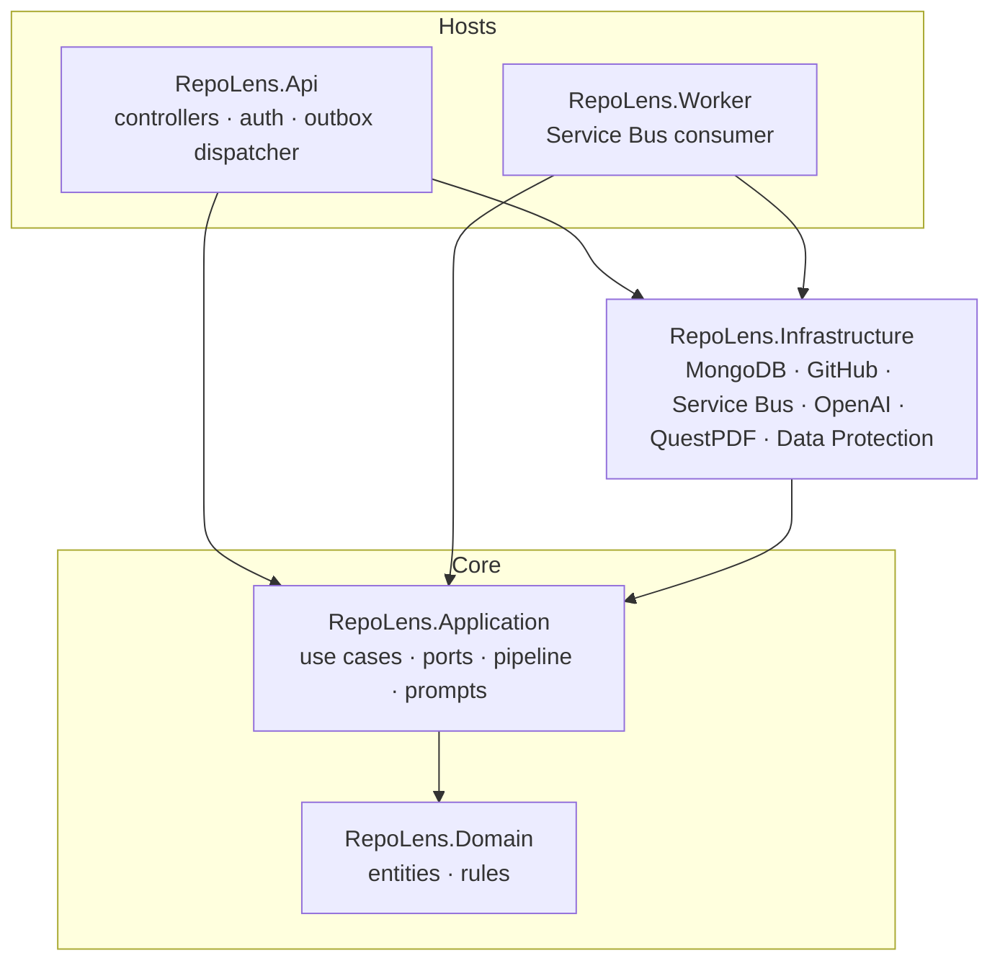
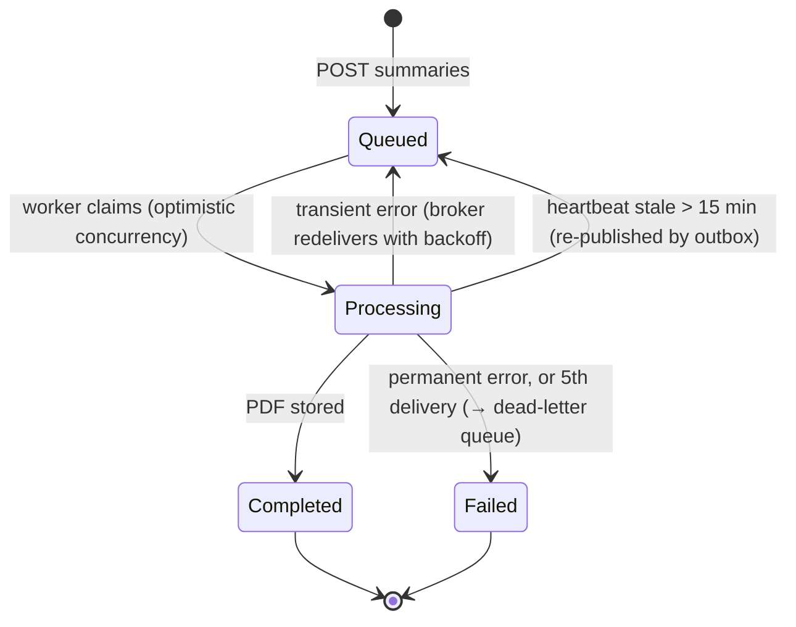

# RepoLens architecture

This document records how RepoLens is put together and why. The [README](../README.md) covers running and deploying it.

## Goals

1. A user signs in with GitHub and sees every repository they can access.
2. **Summarize** turns a repository into an onboarding PDF a new developer can follow. It can take minutes, so it must not tie up the API: it is **event-driven**.
3. The user can ask questions about a repository and get answers grounded in its code.
4. MongoDB is the only data store. Azure services are used where they fit: Service Bus, Azure OpenAI, Key Vault and Container Apps.
5. The code follows SOLID and Clean Architecture, so infrastructure can change without touching use cases.

## Components

| Port (Application) | Implementations (Infrastructure) |
|---|---|
| `IUserRepository`, `IRepoRepository`, `IRepoIndexRepository`, `ISummaryJobRepository`, `IConversationRepository`, `IAuthCodeRepository`, `IRefreshTokenRepository` | MongoDB repositories with optimistic concurrency |
| `ICodeChunkStore` | MongoDB `code_chunks` |
| `ICodeSearch` | `InAppVectorSearch` (any MongoDB), `AtlasVectorSearch` (`$vectorSearch`), `CosmosVectorSearch` (`cosmosSearch`) |
| `IFileStorage` | `GridFsFileStorage` |
| `IMessagePublisher`, `IMessageHandler<T>` | Azure Service Bus publisher/consumer, or in-memory channels |
| `IGitHubClient` | Typed `HttpClient` with a resilience pipeline |
| `ISummaryPdfRenderer` | QuestPDF |
| `ITokenProtector`, `IAccessTokenIssuer`, `ISecretTokenGenerator` | ASP.NET Core Data Protection, JWT (HMAC-SHA256), 256-bit random tokens |
| `IChatClient`, `IEmbeddingGenerator` (Microsoft.Extensions.AI) | OpenAI SDK (OpenAI or the Azure OpenAI v1 endpoint) |

### SOLID in practice

- **Single responsibility**: each pipeline stage is its own class (`ResolveCommitStep`, `DownloadSourceStep`, `IndexCodeStep`, `GenerateSummaryStep`, `RenderPdfStep`, `StorePdfStep`). Retry policy lives in `SummaryJobProcessor`, outbox logic in `SummaryOutboxDispatcher`.
- **Open/closed**: `SummaryPipeline` runs whatever `ISummaryPipelineStep`s are registered, ordered by `Order`. Message routing lives in `MessageTopology`.
- **Liskov**: the in-memory bus and Service Bus share retry and dead-letter semantics, and the three `ICodeSearch` implementations return the same shape. Callers can't tell which one they have.
- **Interface segregation**: one repository per aggregate. `ICodeChunkStore` (write) and `ICodeSearch` (read) are separate.
- **Dependency inversion**: Application depends only on ports and `Microsoft.Extensions.AI` abstractions. Domain has no dependencies at all; its MongoDB mapping is done with class maps in Infrastructure.

## Summary job lifecycle

Stages inside `Processing`: `ResolvingCommit` → `DownloadingSource` → `IndexingCode` → `GeneratingSummary` → `RenderingPdf` → `StoringPdf`, each with a progress percentage for the UI.

## Key decisions

| Decision | Choice | Why |
|---|---|---|
| Database | MongoDB only (Cosmos DB for MongoDB vCore in Azure) | Requested; documents fit jobs, conversations and summaries; vCore has vector search |
| PDF storage | GridFS | Keeps everything in MongoDB; `IFileStorage` allows Blob Storage later |
| Long-running work | Service Bus queue + separate Worker, KEDA scale-to-zero | The API stays fast; the Worker scales independently and retries safely |
| Reliable publish | Outbox marker on the job document | Single-document atomicity, so no multi-document transactions (or replica set) needed |
| Idempotency | Unique partial index on active jobs + reuse by commit SHA | The database enforces it, even across API replicas |
| Repository download | Zipball at a pinned commit | One API call instead of one per file; consistent snapshot |
| Summary generation | Map → reduce with a fixed JSON schema | Works for tiny and huge repositories; the same PDF layout every time |
| Q&A | RAG over chunks built by the Summarize job | Answers cite exact lines; no second indexing pipeline |
| Auth for a SPA | GitHub OAuth (PKCE) → one-time code → JWT + rotating refresh token | Tokens never appear in URLs; refresh-token reuse ends the session |
| GitHub tokens at rest | Data Protection, key ring in MongoDB, wrapped by a Key Vault key | API and Worker share keys; keys are encrypted in Azure |
| Local development | In-memory bus + in-app vector search + DevMongo | Runs with no Docker and no Azure subscription; same code paths |

## Security

- The GitHub token is encrypted at rest and never returned by the API. Auth codes and refresh tokens are stored only as SHA-256 hashes, with TTL indexes.
- Every query is scoped to the signed-in user. Requests for other users' resources return `404`.
- Repository content is treated as untrusted data: prompts tell the model never to follow instructions inside it. Archive paths are checked for traversal and file reads are size-bounded.
- Per-user rate limits protect GitHub quota and AI spend.
- In Azure: managed identity everywhere, secrets in Key Vault, Azure OpenAI with local auth disabled.
